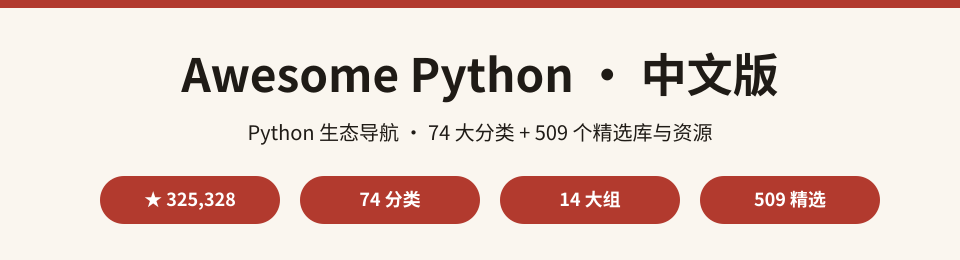
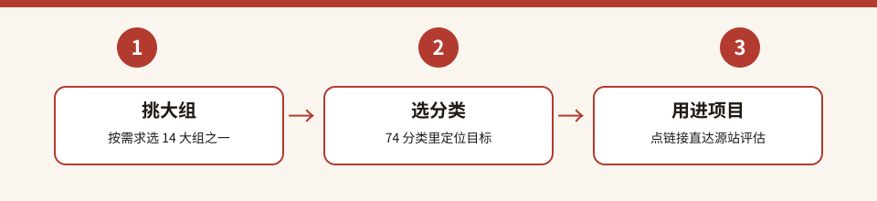

  

# Awesome Python 中文版

> **GitHub 前 10 星标的 Python 生态精选 · 中文导航版**
>
> 源自 GitHub 上 **325,000+ ★** 的 [vinta/awesome-python](https://github.com/vinta/awesome-python)，收录 **74 个精选分类、509 个框架 / 库 / 工具 / 资源**，按 14 大组组织，从 AI 智能体、Web 框架到数据库、DevOps、安全全覆盖，是 Python 开发者找库的第一入口。

---

⭐ 如果对你有帮助，点个 Star 支持中文开源

## 目录

- [这是什么？](#这是什么)
- [为什么值得收藏](#为什么值得收藏)
- [数据一览](#数据一览)
- [快速开始](#快速开始)
- [分类清单](#分类清单)
- [全量分类索引](#全量分类索引)
- [完整数据](#完整数据)
- [常见问题 FAQ](#常见问题-faq)
- [参与贡献](#参与贡献)
- [致谢](#致谢)
- [许可声明](#许可声明)

---

## 这是什么？

**Awesome Python 中文版** 是对全球最权威的 Python 生态精选列表 [vinta/awesome-python](https://github.com/vinta/awesome-python) 的中文二次开发项目。

源项目由 Vinta 创建并持续维护，被公认为「Python 开发者找库的第一入口」。2025 年源项目完成重大改版，将 **509 个精选条目** 重组为 **14 大组 × 74 个分类**：AI & ML（智能体 / 深度学习 / 机器学习）、Web 开发（框架 / API / 服务器）、HTTP 与爬虫、数据库与存储、数据与科学、开发者工具、DevOps、CLI 与 GUI、文本与文档、媒体、Python 语言、工具链、安全、其他——几乎覆盖 Python 生态的每个角落。

**中文版做了什么：**

- 🗂️ 把源仓 **74 个分类** 全量提取为中文索引（[categories-index.md](categories-index.md)），按 14 大组分组，附每类条目数与中文译名；
- ⚡ 在本 README 给出 14 大组总览表与分类导读；
- 📖 提炼「三步上手」查找路径与 FAQ，让你快速定位到需要的库。

## 为什么值得收藏

- 🏆 **GitHub 前 10 星标**：325,000+ ★，全球 Python 开发者共同验证的质量；
- 🗂️ **74 分类全覆盖**：AI 智能体、Web 框架、数据库驱动、测试、安全……一个仓库找遍整个生态；
- ⚡ **2025 全新改版**：分类体系大重构，紧跟 LangChain / vLLM / FastAPI 等最新热点；
- 🔍 **官网可搜索**：源项目配套 [awesome-python.com](https://awesome-python.com/) 官网，支持搜索与筛选；
- 🆓 **CC BY 4.0 宽松许可**：可自由引用与传播，只需署名；
- 🇨🇳 **中文友好**：全量分类译名 + 条目导读，英文条目名也不再劝退。

## 数据一览

  

> 数字全部来自源仓 [README.md](https://github.com/vinta/awesome-python/blob/master/README.md) 新版全文实际统计（星数 GitHub 实测；分类数按 `### ` 标题计数；条目数按 `- [名称](url)` 列表项计数，2026-10-05 核实）。

## 快速开始

### 三步上手

  

1. **挑大组**：想找 Web 后端 → Web Development；想做 AI 应用 → AI & ML；想管运维 → DevOps；
2. **选分类**：在 [categories-index.md](categories-index.md) 里定位到 74 分类之一（如「Web Frameworks 11 条」）；
3. **用进项目**：点条目链接直达源站，看文档、比星标、评估后接入你的项目。

### 示例：找异步 Web 框架

进入 Web Development 大组 → Web Frameworks 分类：starlette（轻量 ASGI）、tornado（异步网络库）、litestar、reflex（全栈）一目了然；再配合 ASGI 服务器分类的 uvicorn / hypercorn，即可快速搭起异步 Web 栈。

## 分类清单

14 大组总览（完整 74 分类见 [categories-index.md](categories-index.md)）：

| 大组 | 分类数 | 条目数 | 代表分类 |
| --- | --- | --- | --- |
| AI & ML | 6 | 68 | AI 智能体 34 / 深度学习 / 机器学习 |
| Web Development | 11 | 52 | Web 框架 / Web API / 认证 |
| HTTP & Scraping | 3 | 17 | HTTP 客户端 / 网络爬虫 |
| Database & Storage | 6 | 42 | ORM / 数据库驱动 / 缓存 |
| Data & Science | 7 | 49 | 数据可视化 / 科学计算 |
| Developer Tools | 7 | 64 | 测试 20 / 代码分析 / 调试 |
| DevOps | 7 | 42 | DevOps 工具 / 任务队列 |
| CLI & GUI | 3 | 34 | CLI 开发 / GUI 开发 |
| Text & Documents | 4 | 43 | 文件格式处理 18 / 文本处理 |
| Media | 3 | 22 | 图像处理 / 音视频处理 |
| Python Language | 5 | 27 | 异步编程 / 函数式编程 |
| Python Toolchain | 5 | 26 | 包管理 / 环境管理 |
| Security | 4 | 13 | 密码学 / 渗透测试 |
| Other | 3 | 10 | 硬件 / 杂项 |

## 全量分类索引

📄 **[categories-index.md](categories-index.md)** — 收录源仓全部 **74 个分类**（按 14 大组分组）：中文译名 + 英文原名 + 条目数 + 源 README 锚点直达链接。

## 完整数据

- 📦 源仓库：[vinta/awesome-python](https://github.com/vinta/awesome-python)（默认分支 `master`，CC BY 4.0）
- 👤 作者：Vinta 及社区贡献者（[contributors](https://github.com/vinta/awesome-python/graphs/contributors)）
- 🌐 官网（可搜索筛选）：https://awesome-python.com/
- 📄 源 README（英文原文）：[README.md](https://github.com/vinta/awesome-python/blob/master/README.md)

## 常见问题 FAQ

**Q1：这个列表和 PyPI 有什么区别？**

PyPI 是全部 Python 包的总仓库（含大量低质量包）；Awesome Python 是社区人工精选的高质量列表，每个分类只收录真正好用的框架与库。

**Q2：条目有评价或对比吗？**

源项目条目带一句话描述（作者维护），不做打分；选择时可以结合条目星标与文档质量判断，或用官网搜索筛选。

**Q3：为什么分类体系和网上老版本不一样？**

源项目 2025 年完成了分类体系大改版（从旧版 90 分类重组为 14 大组 × 74 分类）。本中文版以**最新版**为准（2026-10-05 实时抓取）。

**Q4：这个中文版和源项目是什么关系？**

本项目是中文**分类导航与导读**，所有条目与链接都在源项目。分类链接跳转源 README 锚点，版权归源项目及贡献者。

## 参与贡献

- 🐛 发现译名或链接错误：提 Issue；
- 🌐 补充 / 修正分类中文译名：Fork 后修改 [categories-index.md](categories-index.md) 提 PR；
- 📝 分享你的 Python 找库经验：欢迎在 Issue 交流。

## 致谢

- 感谢 [Vinta](https://github.com/vinta) 与全体贡献者（[contributors](https://github.com/vinta/awesome-python/graphs/contributors)）打造并长期维护这份 Python 生态精选；
- 感谢源项目 2025 年改版让分类体系更清晰；
- 感谢每一位正在 Python 生态里探索的你 🌟

## 许可声明

- 本仓库代码与文档：**MIT License**（见 [LICENSE](LICENSE)，Copyright (c) 2026 zieang88888）；
- 源项目 [vinta/awesome-python](https://github.com/vinta/awesome-python)：**CC BY 4.0**；
- 第三方声明与完整署名见 [THIRD_PARTY_NOTICES.md](THIRD_PARTY_NOTICES.md)。

## 姊妹项目

中文开源矩阵，一网打尽开发者的知识库：

- [zhskills · 中文技能库](https://github.com/zieang88888/zhskills)
- [awesome-ai-tools-zh · AI 工具导航](https://github.com/zieang88888/awesome-ai-tools-zh)
- [free-programming-books-zh · 编程书籍大全](https://github.com/zieang88888/free-programming-books-zh)
- [system-design-zh · 系统设计面试](https://github.com/zieang88888/system-design-zh)
- [ohmyzsh-zh · 终端效率神器](https://github.com/zieang88888/ohmyzsh-zh)
- [llm-course-zh · LLM 课程导航](https://github.com/zieang88888/llm-course-zh)
- [design-resources-for-developers-zh · 设计资源大全](https://github.com/zieang88888/design-resources-for-developers-zh)
